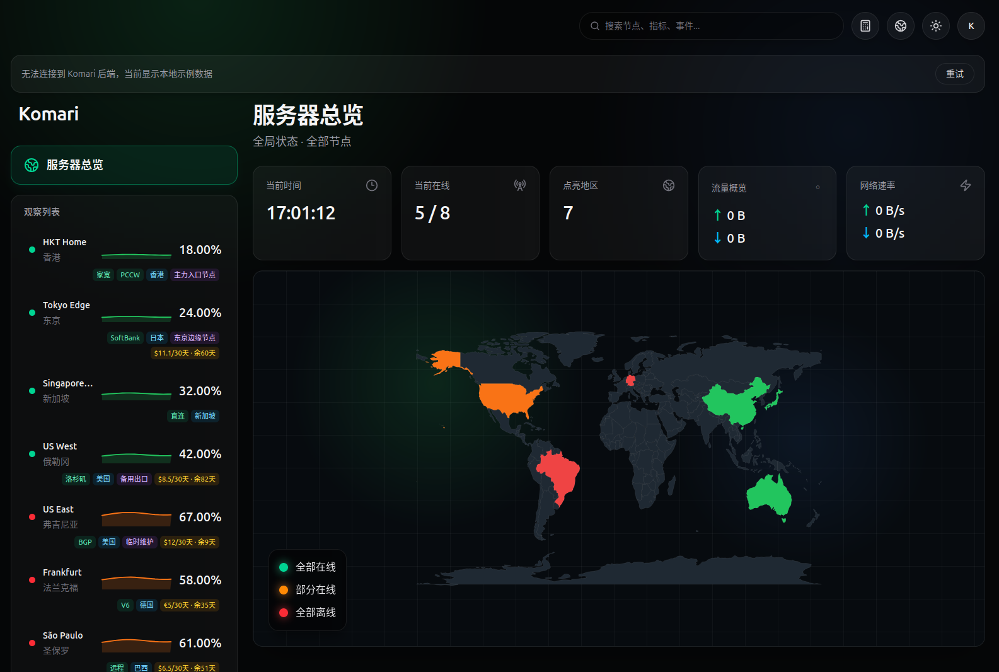
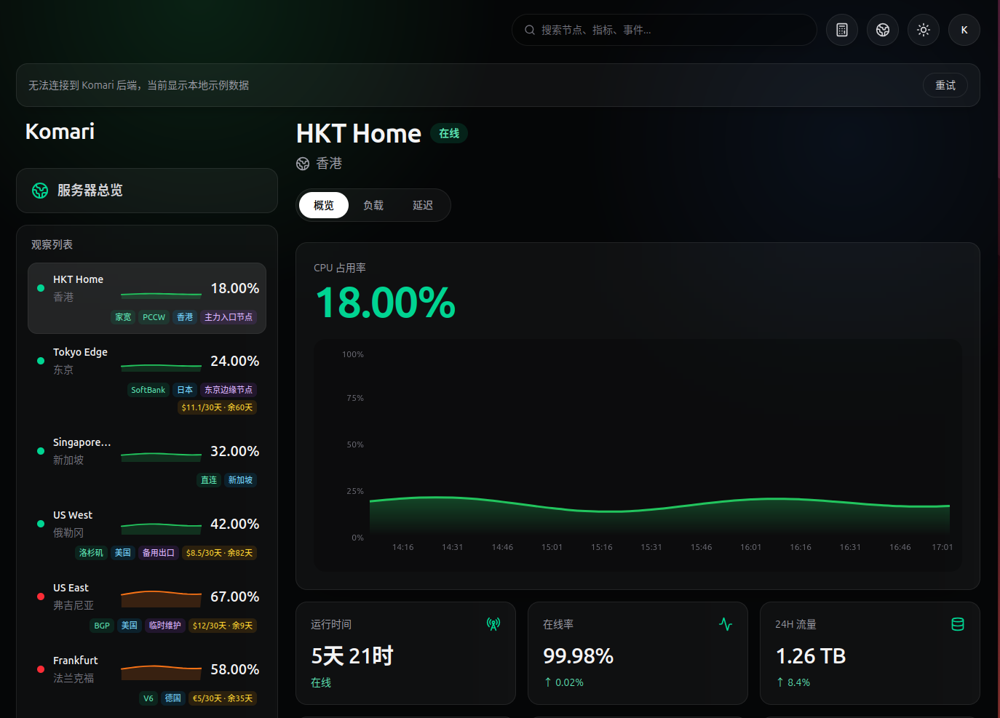

# Komari Apple Stocks Theme

一个受 Apple「股市」App 启发设计的 Komari 第三方主题，采用深色玻璃拟态界面，包含服务器总览、节点详情、世界地图、负载图表、延迟监控、语言切换和移动端自适应布局。

## 功能特性

- Apple Stocks 风格深色 UI
- 服务器总览页面
- 世界地图节点分布显示
- 节点详情页面
- CPU、内存、磁盘、网络等实时状态展示
- 负载历史图表
- 延迟监控图表
- 观察列表 CPU 小折线图
- 支持在线 / 离线状态显示
- 支持标签、分组、公开备注、账单信息展示
- 支持简体中文、繁体中文、英文切换
- 支持明暗模式切换
- 支持移动端 / 窄屏自适应布局
- 支持 Komari 主题管理上传使用

## 预览

## 安装使用

### 方法一：使用Github链接

1. 进入 Komari 后台
2. 打开「主题管理」
3. 点击「导入主题」
4. 输入本项目链接`https://github.com/ErrorCode36459/komari-apple-stocks-theme/`
5. 点击「检测」
6. 启用主题

### 方法二：下载 Release 主题包

1. 前往本仓库的 Releases 页面
2. 下载最新版本的 `komari-apple-stocks-theme.zip`
3. 进入 Komari 后台
4. 打开「主题管理」
5. 上传该 `.zip` 文件
6. 启用主题
